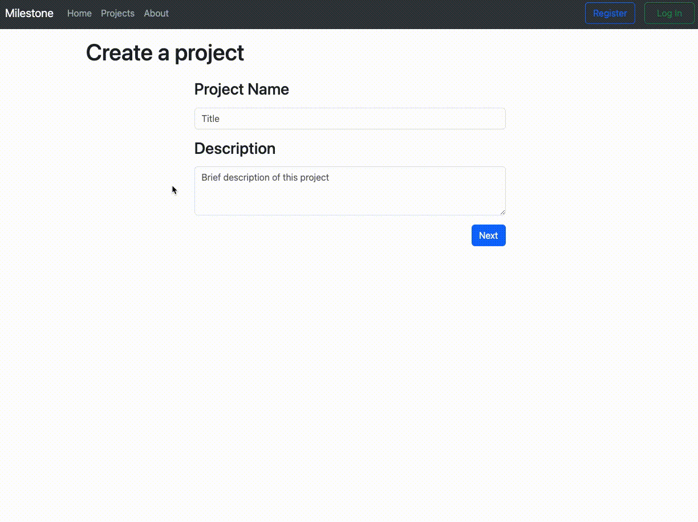

# milestone

A full stack JavaScript application for organizers who want to track a project.

## Why I Built This

In previous jobs I had to plan and track the progress of different projects. This inspired me to create a project management tool that provides a more organized approach to tracking and completing a project.

## Technologies Used

- React.js
- Webpack
- Bootstrap 5
- React-Bootstrap
- Node.js
- Express.js
- PostgreSQL
- Argon2
- JSON Web Token
- HTML5
- CSS3
- Dokku

## Live Demo

Try the application live at [https://milestone.parkersiu.com/](https://milestone.parkersiu.com/)

## Features

- Users can create a project.
- Users can create milestones for each project.
- Users can create, edit, and delete tasks for each milestone.
- Users can mark tasks as complete.
- Users can create an account.
- Users can log into their account.

## Stretch Features

- Users can set deadlines for each milestone.
- Users can receive email reminders for deadlines.

## Preview



## Development

### System Requirements

- Node.js 10 or higher
- NPM 6 or higher
- PostgreSQL

### Getting Started

1. Clone the repository.

    ```shell
    git clone https://github.com/parkersiu/milestone
    cd final-project
    ```

1. Install all dependencies with NPM.

    ```shell
    npm install
    ```

1. Import the example database to PostgreSQL.

    ```shell
    npm run db:import
    ```

1. Start the project. Once started you can view the application by opening http://localhost:3000 in your browser.

    ```shell
    npm run dev
    ```
